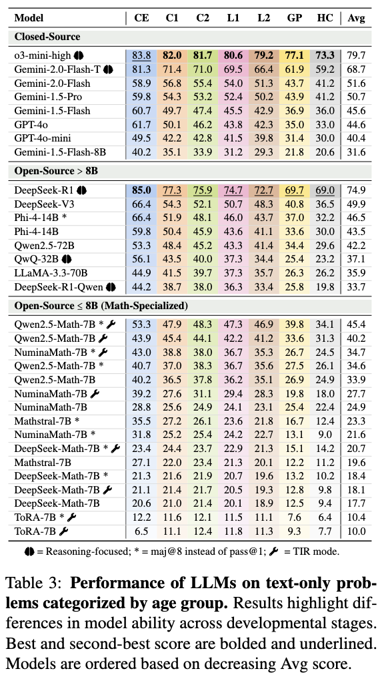
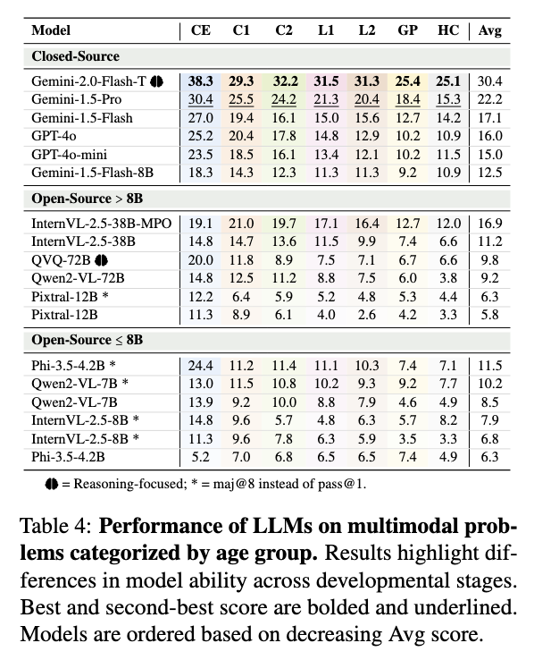
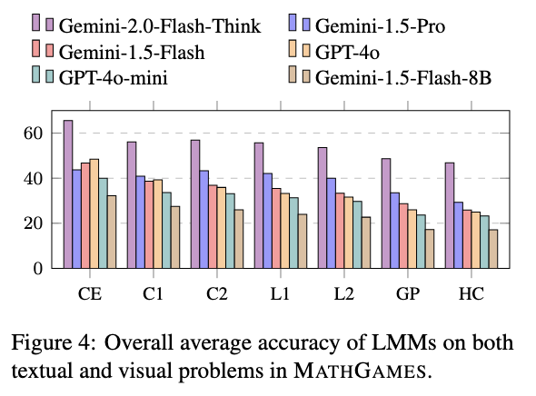
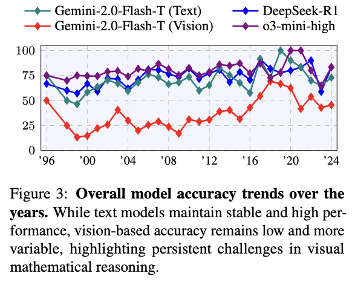
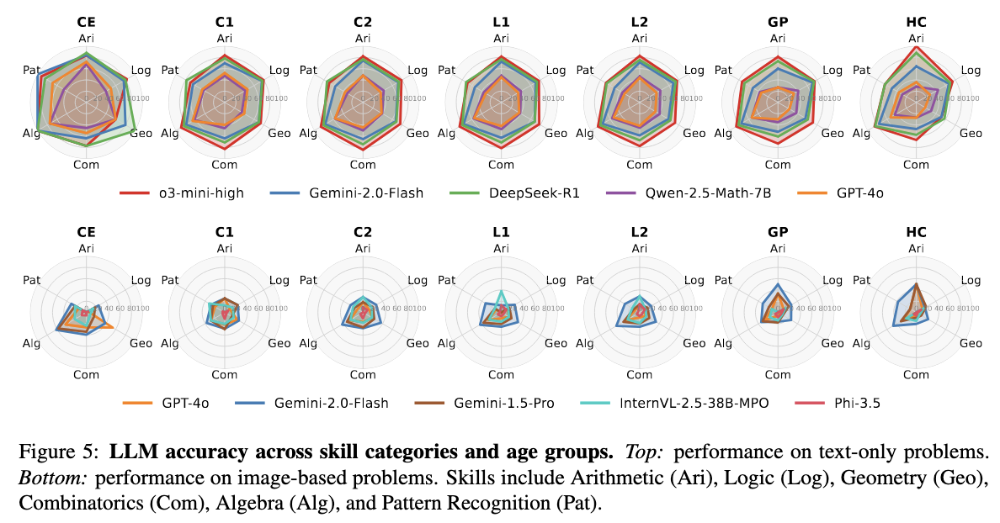

# MathGames: A Benchmark from the International Mathematical Games Competition  

This repository contains the code and data for our paper:  
**_Can Large Language Models Win the International Mathematical Games?_**  

MathGames is a benchmark featuring **2,183 high-quality, playful-style mathematical problems** in an open-ended format (i.e., without multiple-choice answers). The dataset includes:  
- **1,389 textual problems**  
- **794 multimodal problems** (requiring both text and images)  

## 📂 Dataset Access  

The dataset is available as a **Hugging Face dataset**. However, to maintain anonymity, we currently provide it only as a JSONL file:  
📄 **[`data/math_games.jsonl`](data/math_games.jsonl)**  

To reconstruct the **multimodal exercises**, please download the corresponding images from our **[Google Drive folder](https://drive.google.com/drive/folders/1Dq32HB9E5HWTdL5HWC66CAmotwFnUpDk?usp=sharing)**.

## 🔎 Dataset Inspection 

Run this script to quickly preprocess and inspect the dataset. Ensure that the images are stored within a local folder `images/`.

```python
from datasets import load_dataset
from PIL import Image

def load_and_process_image(example):
    """Loads and processes the image for a given example."""
    image_path = None
    try:
        image_path = example['image']
        with Image.open(image_path) as img:
            img = img.convert('RGB')
            example['image_data'] = img # Store the PIL Image object
            return example
    except Exception as e:
        example['image_data'] = None
        return example

# Load the dataset
dataset = load_dataset("json", data_files="data/math_games.jsonl")['train']

# Process and store images using map
dataset = dataset.map(load_and_process_image)
dataset = dataset.remove_columns(["image"])
dataset = dataset.rename_column("image_data", "image")
print(dataset[0])

# Access and use the PIL.Image object directly to display an example image
if dataset[0]['image'] is not None:
    img = dataset[0]['image']
    try:
        from IPython.display import display # Import only if in an IPython environment
        display(img) # Use display() in Jupyter notebooks or IPython environments
    except ImportError:
        img.show() # Use img.show() for standard Python scripts or if not in an IPython environment
        
    # You can now use 'img' directly for further image processing
    print(f"Image mode: {img.mode}, size: {img.size}")
```

To access text-only problems:

```python
dataset_text = dataset.filter(lambda example: example['image'] is None)
```

To access multimodal problems:
```python
dataset_multimodal = dataset.filter(lambda example: example['image'] is not None)
```

---

## Run Experiments  

To reproduce the experiments, refer to the README inside **[`src/`](src/)**.  
It contains scripts and detailed instructions for running experiments with LLMs using **vLLM** and APIs such as **OpenAI, DeepSeek, and Gemini**.  


---

## Results 


### Text-only Problems

<p align="center">
  
</p>

### Multimodal Problems

<p align="center">
  
</p>

### Overall 

<p align="center">
  
</p>

### Perfomance across years

<p align="center">
  
</p>

### Perfomance across math skills

<p align="center">
  
</p>

