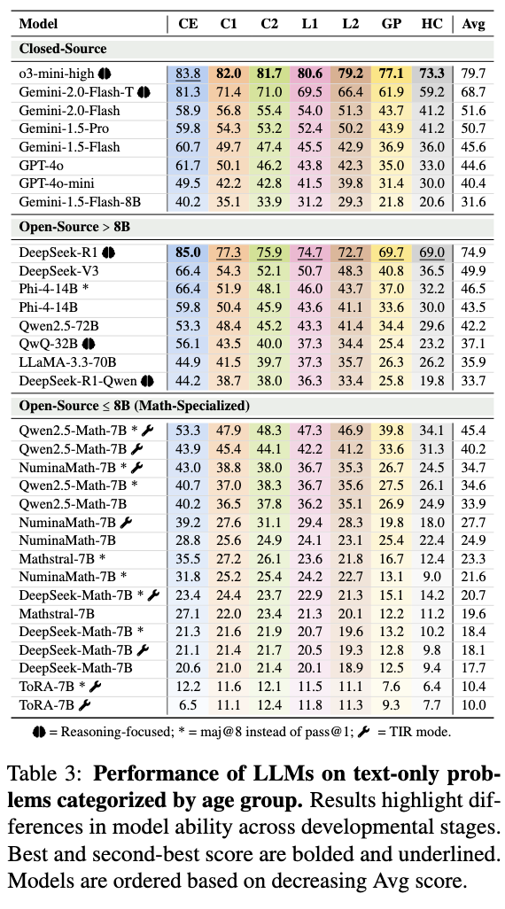
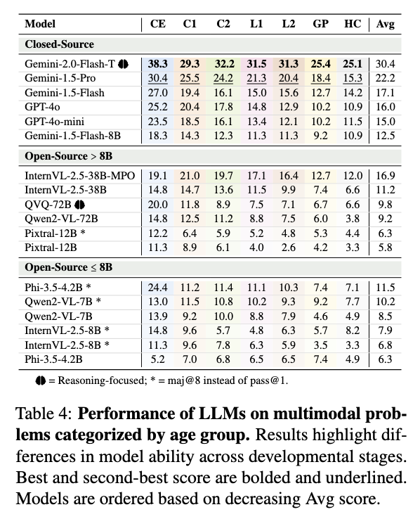
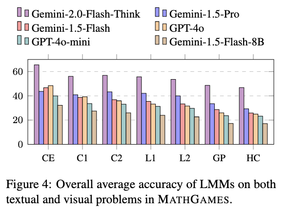
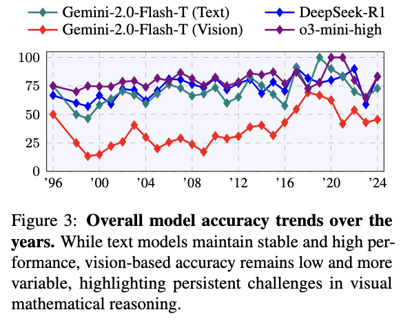
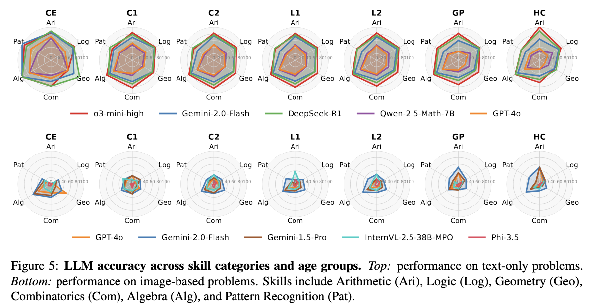

# MathGames: A Benchmark from the International Mathematical and Logical Games Competition  

This repository contains the code and data for our **EMNLP 2025 Main Track paper**:  
📄 [Can Large Language Models Win the International Mathematical Games?](https://aclanthology.org/2025.emnlp-main.488.pdf)

MathGames is a benchmark featuring **2,183 high-quality, playful-style mathematical problems** in an open-ended format (i.e., without multiple-choice answers). The dataset includes:  
- **1,389 textual problems**  
- **794 multimodal problems** (requiring both text and images)

Problems are sourced from the [International Mathematical and Logical Games Championships](https://it.wikipedia.org/wiki/Campionati_internazionali_di_giochi_matematici), an annual international competition promoting creative and logical problem solving.

> All materials in **MathGames** are sourced from the official online archive of the [PRISTEM Center, Bocconi University](https://giochimatematici.unibocconi.eu), which retains **full rights** to the original content.
We obtained **explicit authorization** from PRISTEM to use, translate, and distribute the problems and solutions in English, in full compliance with applicable **copyright and licensing regulations**.
This dataset is provided **exclusively for research and evaluation purposes**, with the primary goal of advancing studies on **mathematical and logical reasoning in LLMs**.
Use of the data for **model training, commercial redistribution, or derivative works** is **not permitted** without prior written authorization from PRISTEM, Bocconi University.
 

## 📂 Dataset Access  

The dataset is available as a **Hugging Face dataset**. 

You can easily load the **MathGames** benchmark using the 🤗 **`datasets`** library:

```python
from datasets import load_dataset

# Load the multimodal or textual subset
ds_multimodal = load_dataset("disi-unibo-nlp/MathGames", split="multimodal")  # or split="textual"

# Inspect the first entry
print(ds_multimodal[0])
```

This is an example of a multimodal entry:

```
{
  'id': '1952',
  'year': '1996',
  'type': 'semifinal',
  'multimodal': 'yes',
  'category': 'C1 C2 L1 L2 GP',
  'subject': 'Logic',
  'answer': 'The sum of four cells is always 24. The grid is:\nRow 1: 1, 6, 3\nRow 2: 9, 8, 7\nRow 3: 2, 5, 4',
  'question': 'Fill the nine cells of the square above with the numbers from 1 to 9 (1 and 7 have already been placed) such that the sum of the numbers written in each 4-cell square (like those highlighted in the figure) is always the same (figure).',
  'image': <PIL.JpegImagePlugin.JpegImageFile image mode=RGB size=132x75>
}
```

---

## Run Experiments  

To reproduce the experiments, refer to the README inside **[`src/`](src/)**.  
It contains scripts and detailed instructions for running experiments with LLMs using **vLLM** and APIs such as **OpenAI, DeepSeek, and Gemini**.  


---

## Results 


### Text-only Problems

<p align="center">
  
</p>

### Multimodal Problems

<p align="center">
  
</p>

### Overall 

<p align="center">
  
</p>

### Perfomance across years

<p align="center">
  
</p>

### Perfomance across math skills

<p align="center">
  
</p>

